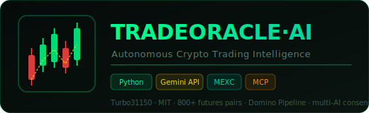
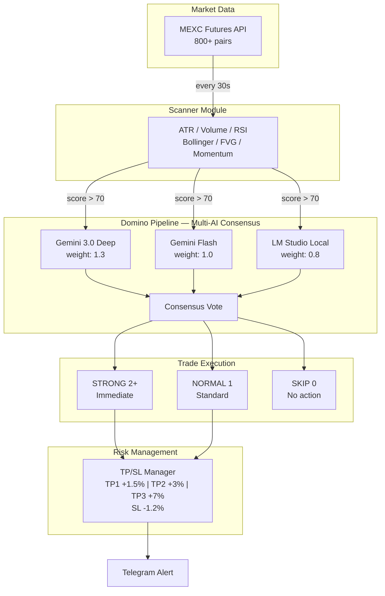

<div align="center">
  
  <br/><br/>

  [](https://github.com/Turbo31150/TradeOracle/actions/workflows/ci.yml)
  [](LICENSE)
  [](https://python.org)
  [](https://github.com/Turbo31150/TradeOracle/stargazers)
  [](#domino-pipeline)
  [](#signal-types)
  [](#)
  [](#mcp-server)
  [](#api)

  <br/>
  <h3>Multi-model AI consensus engine for crypto futures trading</h3>
  <p><em>End-to-end algorithmic trading: scan, analyze with multi-AI consensus, execute with automated TP/SL &mdash; zero human intervention required.</em></p>

  <br/>

  [Pipeline](#domino-pipeline) &bull; [Signals](#signal-types) &bull; [Scoring](#multi-axis-scoring) &bull; [MCP Server](#mcp-server) &bull; [Installation](#installation) &bull; [Configuration](#configuration)


</div>

---

## Overview

**TRADEORACLE AI** is an autonomous crypto trading agent powered by **Google Gemini 3**. It continuously scans **800+ MEXC futures contracts**, generates trading signals through a proprietary **Domino Pipeline** with multi-AI consensus voting, and executes trades with fully automated take-profit and stop-loss management.

Built for the **Google Cloud Agent Development Kit** hackathon, it demonstrates how an AI agent can manage a complete trading strategy &mdash; from signal detection to order execution &mdash; without human intervention.

---

## Quick Start

```bash
git clone https://github.com/Turbo31150/TradeOracle.git && cd TradeOracle
pip install -r requirements.txt
cp .env.example .env && python entrypoint.py
```

---

## Architecture



---

## Features

| Feature | Description |
|:--------|:------------|
| **Multi-Model Consensus** | 3 AI models vote independently (Gemini Deep, Gemini Flash, LM Studio) with weighted scoring |
| **Signal Detection** | Breakout, reversal, bounce, momentum, and Fair Value Gap detection across 800+ pairs |
| **Risk Management** | Automated 3-tier take-profit (1.5% / 3% / 7%) with stop-loss at -1.2%, position sizing |
| **Telegram Alerts** | Real-time notifications for signals, executions, TP hits, and stop-loss triggers |
| **MCP Integration** | 40+ tools exposed via Model Context Protocol for Claude Code and external clients |
| **FastAPI Backend** | WebSocket + REST API for real-time dashboard and programmatic access |

---

## Domino Pipeline

The Domino Pipeline is the core analysis engine. Each signal candidate passes through multiple AI models that vote independently before a consensus decision is made.

```
  +-------------------------------------------+
  |            MEXC Futures API                |
  |          800+ trading pairs               |
  +---------------------+---------------------+
                        |
                        v  every 30s
  +-------------------------------------------+
  |           SCANNER MODULE                   |
  |                                           |
  |  Indicators:                              |
  |    ATR . Volume . Momentum . RSI          |
  |    Bollinger Bands . Fair Value Gap       |
  |                                           |
  |  Output: Signal candidates (score > 70)   |
  +---------------------+---------------------+
                        |
                        v
  +-------------------------------------------+
  |          DOMINO PIPELINE                   |
  |       (Multi-AI Parallel Analysis)         |
  |                                           |
  |  +-------------+  +-----------+  +------+ |
  |  | Gemini 3.0  |  | Gemini    |  | LM   | |
  |  | Deep        |  | Flash     |  |Studio| |
  |  | Analysis    |  | Validate  |  | Hedge| |
  |  | weight: 1.3 |  | weight: 1 |  | 0.8  | |
  |  +------+------+  +-----+-----+  +--+---+ |
  |         |              |            |      |
  |         +-------+------+------+-----+      |
  |                 |  CONSENSUS  |             |
  |                 +------+------+             |
  +------------------------+-------------------+
                           |
              +------------+------------+
              |            |            |
              v            v            v
         STRONG (2+)   NORMAL (1)   SKIP (0)
         Immediate     Standard     No action
         execution     execution
              |            |
              v            v
  +-------------------------------------------+
  |          TP/SL MANAGER                     |
  |                                           |
  |    TP1  +1.5%  close 33% of position     |
  |    TP2  +3.0%  close 75% of position     |
  |    TP3  +7.0%  close 100% (full exit)    |
  |    SL   -1.2%  stop loss                 |
  +---------------------+---------------------+
                        |
                        v
                 Telegram Alert
```

---

## Signal Types

| Signal | Trigger Conditions | Typical Win Rate |
|:-------|:-------------------|:----------------:|
| **BREAKOUT** | Volume > 2x average, ATR spike, resistance break | ~62% |
| **REVERSAL** | RSI extreme + divergence detected | ~58% |
| **BOUNCE** | Price touching key support zone | ~55% |
| **MOMENTUM** | Strong momentum wave initiated | ~60% |
| **FVG** | Fair Value Gap &mdash; unfilled price imbalance | ~57% |

---

## Multi-Axis Scoring

Every signal is scored across multiple dimensions before reaching the Domino Pipeline:

| Axis | Weight | Description |
|:-----|:------:|:------------|
| **Technical** | 30% | RSI, MACD, Bollinger, ATR composite |
| **Volume** | 25% | Volume anomaly detection vs 20-period average |
| **Momentum** | 20% | Price acceleration and trend strength |
| **Structure** | 15% | Support/resistance levels, FVG zones |
| **Sentiment** | 10% | Funding rate, open interest delta |

**Minimum composite score: 70/100** to enter the Domino Pipeline.

---

## MCP Server

TradeOracle exposes **40+ MCP tools** for integration with Claude Code and other MCP-compatible clients.

### Core Tools

| Tool | Description |
|:-----|:------------|
| `scan_market(symbol, timeframe)` | Scan a specific pair with full indicator suite |
| `get_signal(symbol)` | Get current AI-generated signal |
| `execute_trade(symbol, side, size)` | Execute a market or limit order |
| `get_positions()` | List all open positions with PnL |
| `close_position(symbol)` | Close a specific position |
| `get_pnl(period)` | Aggregate PnL over a time period |
| `set_tp_sl(symbol, tp, sl)` | Configure take-profit and stop-loss |
| `get_market_summary()` | Full market overview with top movers |
| `run_backtest(strategy, period)` | Run historical backtest |
| `get_consensus(symbol)` | View multi-AI consensus breakdown |

### Example Usage

```python
# Via MCP client
result = await mcp.call("scan_market", symbol="BTC_USDT", timeframe="15m")
signal = await mcp.call("get_signal", symbol="BTC_USDT")
await mcp.call("execute_trade", symbol="BTC_USDT", side="long", size=100)
```

---

## Installation

### Prerequisites

- Python 3.11+
- Google Cloud API key (Gemini 3 access)
- MEXC API credentials (futures trading enabled)
- CUDA GPU recommended for local LM Studio inference

### Setup

```bash
git clone https://github.com/Turbo31150/TradeOracle.git
cd TradeOracle

pip install -r requirements.txt

cp .env.example .env
# Fill in: GOOGLE_API_KEY, MEXC_API_KEY, TELEGRAM_BOT_TOKEN...
```

### Run

```bash
# Start the autonomous agent
python entrypoint.py

# Or run as FastAPI server (WebSocket + REST)
python app.py  # Serves on :8080
```

---

## Configuration

```env
# --- Google Cloud / Gemini ---
GOOGLE_API_KEY=AIza...
GOOGLE_CLOUD_PROJECT=my-project

# --- MEXC Futures ---
MEXC_API_KEY=mx0v...
MEXC_SECRET_KEY=...
MEXC_BASE_URL=https://futures.mexc.com/api/v1

# --- Trading Parameters ---
MIN_SCORE=70                # Minimum signal score (0-100)
MIN_VOLUME=1000000          # Minimum 24h volume in USDT
AUTO_TRADE=false            # true = fully autonomous execution
MAX_POSITION_SIZE=500       # Max USDT per position
MAX_CONCURRENT_POSITIONS=5  # Max simultaneous open positions

# --- Notifications ---
TELEGRAM_BOT_TOKEN=...
TELEGRAM_CHAT_ID=...

# --- MCP Server ---
MCP_PORT=8090
```

---

## Project Structure

```
TradeOracle/
├── entrypoint.py            # Agent entry point
├── app.py                   # FastAPI + WebSocket server
├── requirements.txt
├── .env.example
├── agent/                   # Agent brain
│   ├── trading_agent.py     # Main Gemini 3 agent
│   ├── consensus.py         # Multi-AI voting logic
│   └── risk_manager.py      # Position sizing and risk rules
├── pipeline/                # Domino Pipeline
│   ├── scanner.py           # MEXC 800+ pair scanner
│   ├── signals.py           # Signal detection engine
│   └── executor.py          # Order execution
├── mcp_server/              # MCP tool server
│   ├── server.py            # MCP server bootstrap
│   └── tools.py             # 40+ declared tools
├── tools/                   # Utility modules
│   ├── mexc_tools.py        # MEXC API wrapper
│   ├── gemini_tools.py      # Gemini integration
│   └── telegram_tools.py    # Alert notifications
├── database/                # Persistence layer
│   ├── models.py            # SQLAlchemy models
│   └── db.py                # Connection pool
└── config/
    ├── settings.py          # Trading parameters
    └── models_config.py     # AI model configuration
```

---

## Related Projects

| Project | Description |
|:--------|:------------|
| [jarvis-linux](https://github.com/Turbo31150/turbo) | JARVIS Etoile -- Distributed multi-GPU AI orchestration system powering TradeOracle |
| [TradeOracle-Nexus-Elastic](https://github.com/Turbo31150/TradeOracle-Nexus-Elastic) | Elasticsearch-based analytics and backtesting extension for TradeOracle |

---

## Disclaimer

This software is provided for **educational and research purposes only**. Cryptocurrency trading involves substantial risk of loss. Past performance does not guarantee future results. Use at your own risk. The authors are not responsible for any financial losses incurred through the use of this software.

---

## License

This project is licensed under the MIT License. See [LICENSE](LICENSE) for details.

---

<div align="center">
  <br/>
  <strong>Franc Delmas (Turbo31150)</strong> &bull; <a href="https://github.com/Turbo31150">github.com/Turbo31150</a> &bull; Toulouse, France
  <br/><br/>
  <em>TRADEORACLE AI &mdash; Autonomous Crypto Trading Intelligence</em>
</div>

---

<div align="center">

**If you find this project useful, please consider giving it a star!** ⭐

It helps others discover this project and motivates continued development.

[](https://github.com/Turbo31150/TradeOracle)

</div>
